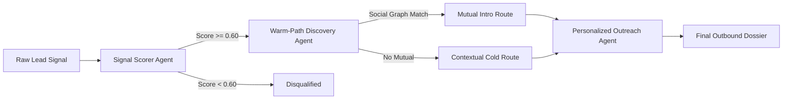

# 🧠 Lead Intelligence Agentic System

<div align="center">
  
  
  
  
</div>

<br>

An autonomous multi-agent pipeline for B2B intelligence and outbound prospecting. Replaces static databases with agentic signal scoring, social graph warm-path mapping, and contextual LLM-driven outreach generation.

---

## 🏗️ Multi-Agent Architecture



---

## 🌟 Specialized Agents

1. **Signal Scorer Agent:** Evaluates ICP fit (Title authority 30%, Industry match 25%, Intent signals 20%).
2. **Warm-Path Discovery Agent:** Analyzes 1st and 2nd-degree connection graphs to discover high-trust warm introduction bridges.
3. **Personalized Outreach Agent:** Synthesizes intent data into non-templated, contextualized outreach copy.

---

## 🚀 Quickstart

```bash
pip install -r requirements.txt
python -m src.orchestrator
```

---

## 📄 License
MIT License. See `LICENSE` for details.
