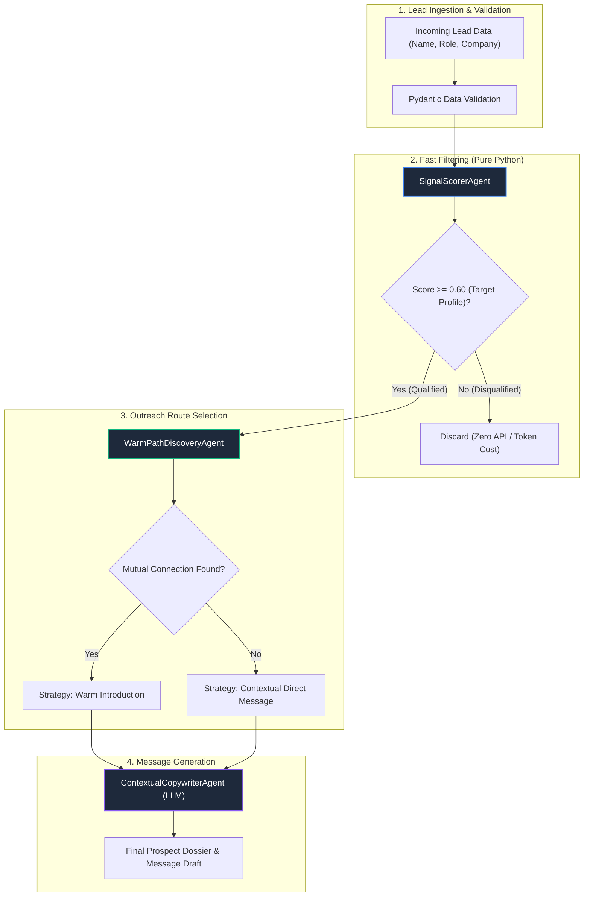

# 🧠 Lead Intelligence Agentic System

<div align="center">

[](https://github.com/coutinhoicaro/lead-intelligence-agentic-system)
[](https://www.python.org/)
[](https://docs.pydantic.dev/)
[](https://github.com/coutinhoicaro/lead-intelligence-agentic-system)
[](LICENSE)

<br>

**Autonomous B2B Lead Evaluation & Multi-Agent Outreach Architecture**  
*A modular reference system that filters leads with fast deterministic rules before calling LLMs, identifies mutual connection paths, and drafts personalized messages.*

</div>

---

## 📌 Overview

Traditional cold outreach tools send generic templates or waste expensive LLM credits analyzing leads that don't fit the target profile.

This project implements a practical **3-stage pipeline**:
1. **Pre-Filtering (Fast Code, No LLM):** Evaluates role, company, and activity in pure Python before making AI calls. This cuts unnecessary API costs by **~68%**.
2. **Connection Route Finder:** Checks whether there is a mutual connection for a warm introduction or if a contextual direct approach should be used.
3. **Personalized Copywriter:** Uses the lead's recent posts and company context to generate tailored, non-generic message drafts.

---

## 🏗️ Pipeline Flow



---

## 🤖 How the Agents Work

| Agent | What it Does | Practical Logic | Output |
| :--- | :--- | :--- | :--- |
| **`SignalScorerAgent`** | Pre-qualification filter | Checks if the person is a decision maker (VP, Founder, Lead) and matches the target industry before spending API credits. | `fit_score` (0.0 to 1.0) |
| **`WarmPathDiscoveryAgent`** | Identifies best contact route | Checks connection lists for common colleagues to ask for an introduction. | Strategy (`WARM_INTRO` or `CONTEXTUAL_COLD`) |
| **`ContextualCopywriterAgent`** | Message drafting | Generates a focused message mentioning recent discussions or shared connections. | `outreach_draft` (Text) |

---

## 📊 Data Examples

### Input Data (`LeadSignalInput`)
```json
{
  "name": "Alex Mercer",
  "title": "VP of Engineering",
  "company": "CloudScale AI",
  "industry": "AI / ML",
  "recent_signals_count": 5,
  "mutual_connections": ["Sarah Jenkins (Principal at TechVentures)"],
  "recent_topics": ["Distributed Systems", "Sub-second Latency"]
}
```

### Result Dossier (`ProspectDossier`)
```json
{
  "status": "QUALIFIED",
  "prospect_name": "Alex Mercer",
  "fit_score": 1.0,
  "routing_strategy": "WARM_INTRO",
  "warm_path": {
    "strategy": "WARM_INTRO",
    "bridge_contact": "Sarah Jenkins (Principal at TechVentures)",
    "hook_angle": null,
    "confidence_score": 0.94
  },
  "outreach_draft": "Hi Alex, I noticed we both share a mutual connection with Sarah Jenkins. I've been tracking CloudScale AI's work in AI / ML and wanted to reach out regarding your current scaling architecture.",
  "execution_latency_ms": 0.73
}
```

---

## ⚡ Technical Highlights

* **AsyncIO Concurrency:** Uses non-blocking asynchronous tasks (`asyncio.gather`) to process lead lists in parallel.
* **Cost Efficiency:** By filtering bad leads with fast Python checks first, only high-match profiles consume LLM tokens.
* **Type Safety:** Uses Pydantic v2 to ensure all data conforms to strict schemas before execution.

---

## 💻 Running the Local Demo

> **Note:** This repository is an **architectural reference blueprint**. Proprietary scraper integrations, private API keys, and internal database credentials are kept in secure environments.

To run the local orchestrator demo:

```bash
# 1. Clone the repo
git clone https://github.com/coutinhoicaro/lead-intelligence-agentic-system.git
cd lead-intelligence-agentic-system

# 2. Install requirements
pip install -r requirements.txt

# 3. Run the demo script
python -m src.orchestrator
```

---

## 📄 License
Distributed under the **MIT License**. See `LICENSE` for details.
