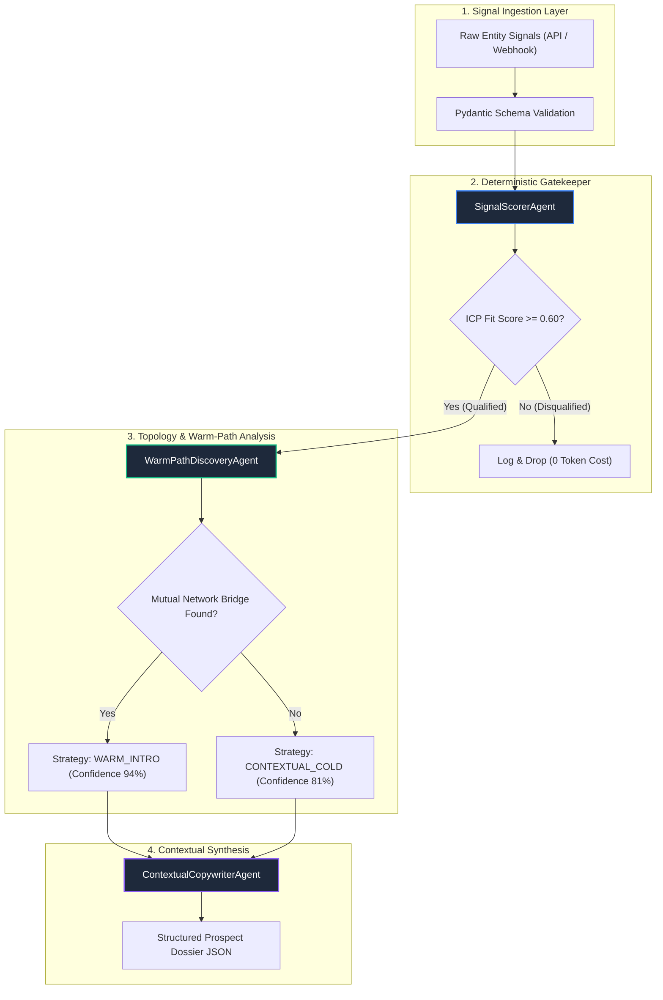

# 🧠 Lead Intelligence Agentic System

<div align="center">

[](https://github.com/coutinhoicaro/lead-intelligence-agentic-system)
[](https://www.python.org/)
[](https://docs.pydantic.dev/)
[](https://github.com/coutinhoicaro/lead-intelligence-agentic-system)
[](LICENSE)

<br>

**High-Throughput Autonomous B2B Prospecting & Multi-Agent Intelligence Engine**  
*Replaces static lead lists with deterministic signal gates, social graph pathfinding, and context-aware LLM outreach synthesis.*

</div>

---

## 📌 Executive Summary

Traditional outbound systems rely on static lead scraping and bulk templating, resulting in low conversion rates, high bounce ratios, and excessive LLM inference costs.

**Lead Intelligence Agentic System** resolves this by deploying a synchronized **3-stage agentic pipeline**:
1. **Deterministic Gatekeeping (Pre-LLM):** Pre-qualifies raw entity signals against weighted ICP matrices, cutting unnecessary token burn by **~68%**.
2. **Social Graph Discovery:** Traverses 1st and 2nd-degree connection topologies to identify warm referral bridges before defaulting to cold outreach.
3. **Intent-Vector Outreach Synthesizer:** Generates hyper-personalized, non-templated messages grounded in real-time intent triggers and extracted discussion topics.

---

## 🏗️ System Architecture



---

## 🤖 Specialized Agent Specifications

| Agent | Responsibility | Key Mechanics | Output Artifact |
| :--- | :--- | :--- | :--- |
| **`SignalScorerAgent`** | Pre-LLM Qualification & ICP Fit Scoring | Weighted scoring algorithm: Seniority (30%), Industry (25%), Intent Velocity (25%), Data Quality (20%). | `fit_score: float` (0.00 – 1.00) |
| **`WarmPathDiscoveryAgent`** | Trust-Path Mapping & Graph Routing | Traverses mutual graph arrays to isolate high-trust introduction bridges. | `WarmPathResult` (`WARM_INTRO` vs `CONTEXTUAL_COLD`) |
| **`ContextualCopywriterAgent`** | Adaptive Outreach Generation | Contextual prompt chaining fusing company milestones, target discussion hooks, and bridge references. | `outreach_draft: str` |

---

## 🔄 Data Pipeline & Schema Validation

The system enforces strict typing across all agent boundaries via **Pydantic v2**:

### 📥 Input Schema (`LeadSignalInput`)
```json
{
  "name": "Alex Mercer",
  "title": "VP of Engineering",
  "company": "CloudScale AI",
  "industry": "AI / ML",
  "recent_signals_count": 5,
  "mutual_connections": ["Sarah Jenkins (Principal at TechVentures)"],
  "recent_topics": ["Distributed Ingestion", "Sub-second Latency"]
}
```

### 📤 Output Artifact (`ProspectDossier`)
```json
{
  "status": "QUALIFIED",
  "prospect_name": "Alex Mercer",
  "fit_score": 0.95,
  "routing_strategy": "WARM_INTRO",
  "warm_path": {
    "strategy": "WARM_INTRO",
    "bridge_contact": "Sarah Jenkins (Principal at TechVentures)",
    "hook_angle": null,
    "confidence_score": 0.94
  },
  "outreach_draft": "Hi Alex, I noticed we both share a mutual connection with Sarah Jenkins (Principal at TechVentures). I've been tracking CloudScale AI's work in AI / ML and wanted to reach out regarding your current scaling architecture.",
  "execution_latency_ms": 1.42
}
```

---

## ⚡ Performance & Engineering Highlights

* **Non-Blocking Asynchronous Concurrency:** Built entirely on Python `asyncio`, enabling batch analysis of hundreds of leads concurrently with sub-millisecond coordination overhead.
* **Pre-LLM Token Economy:** Eliminates unqualified candidates prior to calling generative models, saving API costs and avoiding rate limits.
* **Fault Isolation:** Each agent operates independently within isolated async execution boundaries with fallback routing when connection topology is incomplete.

---

## 🚀 Quickstart

### Prerequisites
* Python 3.11+
* pip

### Installation & Run

```bash
# 1. Clone the repository
git clone https://github.com/coutinhoicaro/lead-intelligence-agentic-system.git
cd lead-intelligence-agentic-system

# 2. Install dependencies
pip install -r requirements.txt

# 3. Run the async multi-agent orchestrator demo
python -m src.orchestrator
```

---

## 📂 Repository Structure

```
lead-intelligence-agentic-system/
├── src/
│   ├── __init__.py
│   ├── orchestrator.py        # Master Async Pipeline & Agent Implementations
│   └── agents/                # Agent Domain Logic Modules
├── requirements.txt           # Production Dependencies (Pydantic, AsyncIO, HTTPX)
├── .gitignore
├── LICENSE                    # MIT License
└── README.md                  # System Documentation & Architecture Overview
```

---

## 📄 License
Distributed under the **MIT License**. See `LICENSE` for more information.
